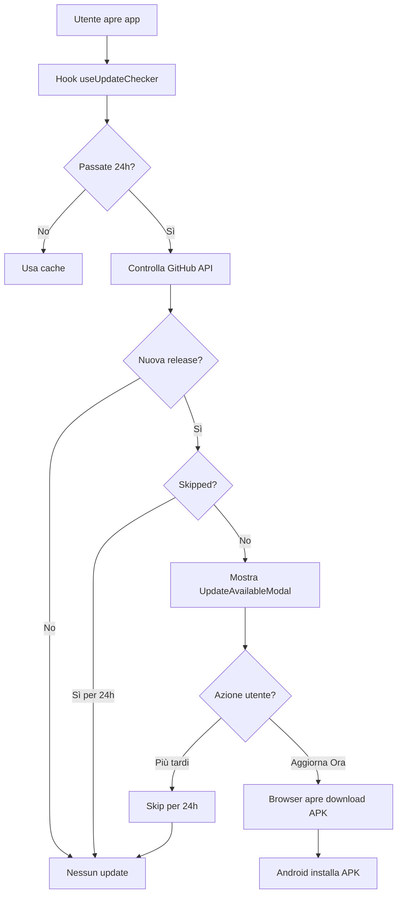

# 🔄 Sistema di Auto-Aggiornamento

## 🎯 Panoramica

L'app **Gestore Spese** implementa un sistema completo di auto-aggiornamento che:

1. ✅ **Controlla automaticamente** le nuove versioni su GitHub ogni 24 ore
2. ✅ **Notifica l'utente** quando un aggiornamento è disponibile con un modal elegante
3. ✅ **Scarica e installa** il nuovo APK direttamente dall'app
4. ✅ **Incrementa automaticamente** il `versionCode` ad ogni build
5. ✅ **Genera automaticamente** le release su GitHub con tag semantici

---

## 📦 Componenti del Sistema

### 1. Hook `useUpdateChecker`

**File**: `hooks/useUpdateChecker.ts`

**Funzionalità**:
- Controlla GitHub Releases ogni 24 ore
- Confronta `versionCode` locale con quello della release più recente
- Supporta tag semantici (`v1.0.2`) e semplici (`v2`)
- Cache intelligente dei risultati
- Funziona **solo su Android nativo** (non web)

**Configurazione**:
```typescript
const GITHUB_REPO_OWNER = 'jerbamichol-del';
const GITHUB_REPO_NAME = 'gestore-capacitor';
const CHECK_INTERVAL_MS = 24 * 60 * 60 * 1000; // 24 ore
```

**Logica di confronto versioni**:
```typescript
// Tag v1.0.2 -> versionCode = 1*1000 + 0*100 + 2 = 1002
// Tag v2 -> versionCode = 2

const updateAvailable = remoteVersionCode > currentVersionCode;
```

---

### 2. Componente `UpdateAvailableModal`

**File**: `components/UpdateAvailableModal.tsx`

**UI/UX**:
- 🎨 Design moderno con gradiente indigo-purple
- 📝 Mostra release notes da GitHub
- 🔽 Bottone "Aggiorna Ora" che scarica l'APK
- ⏱️ Bottone "Più tardi" che skippa per 24h
- ✅ Gestione errori visualizzata

**Comportamento**:
1. Apre il browser per scaricare l'APK da GitHub Release
2. Android gestisce automaticamente l'installazione
3. Dopo 24h lo skip viene resettato e il modal riappare

**Skip Logic**:
```typescript
// Skip per 24 ore
localStorage.setItem('update_skipped_until', (Date.now() + 24 * 60 * 60 * 1000).toString());
```

---

### 3. Integrazione in `App.tsx`

**File**: `App.tsx` (linee 50-68)

**Flow**:
```typescript
// 1. Inizializzazione hook
const { updateInfo, isChecking } = useUpdateChecker();

// 2. Auto-apertura modal quando update disponibile
useEffect(() => {
  if (updateInfo.available && !isCheckingUpdate) {
    // Check skip period
    const skippedUntil = localStorage.getItem('update_skipped_until');
    if (skippedUntil && Date.now() < parseInt(skippedUntil)) return;
    
    // Show modal
    setIsUpdateModalOpen(true);
  }
}, [updateInfo, isCheckingUpdate]);

// 3. Rendering modal
<UpdateAvailableModal
  isOpen={isUpdateModalOpen}
  updateInfo={updateInfo}
  onClose={() => setIsUpdateModalOpen(false)}
  onSkip={() => setIsUpdateModalOpen(false)}
/>
```

---

## 🚀 Sistema di Build e Release

### Workflow GitHub Actions

**File**: `.github/workflows/android-release.yml`

**Trigger**: Push su branch `main` o manuale

**Step principali**:

#### 1. Build Web Assets
```bash
npm install --legacy-peer-deps
npm run build
```

#### 2. Generazione Icone App
```bash
npx @capacitor/assets generate --android
```
➡️ Genera tutte le risoluzioni da `resources/icon.png`

#### 3. Auto-Increment versionCode
```bash
chmod +x scripts/bump-version.sh
./scripts/bump-version.sh
```
➡️ Incrementa automaticamente `versionCode` in `build.gradle`

#### 4. Copy Plugin Files
```bash
cp android-config/plugins/*.java android/app/src/main/java/com/gestore/spese/
```

#### 5. Build APK Debug
```bash
cd android
./gradlew clean assembleDebug
```

#### 6. Crea GitHub Release
```yaml
tag_name: v${{ env.NEW_VERSION_NAME }}
name: "v${{ env.NEW_VERSION_NAME }} (Build ${{ env.NEW_VERSION_CODE }})"
files: gestore-spese.apk
```

---

## 🛠️ Script di Version Bump

**File**: `scripts/bump-version.sh`

**Funzione**:
- Legge il `versionCode` corrente da `build.gradle`
- Lo incrementa di 1
- Aggiorna il file `build.gradle`
- Verifica che l'aggiornamento sia riuscito

**Esempio**:
```bash
📊 Current versionCode: 2
⬆️  Bumping to versionCode: 3
✅ versionCode successfully bumped to 3
📱 Current versionName: 1.0.1
```

---

## 📋 Versioning Schema

### build.gradle
```gradle
defaultConfig {
    versionCode 2         // Numero incrementale (1, 2, 3, ...)
    versionName "1.0.1"   // Versione semantica leggibile
}
```

### GitHub Release Tags
- **versionName**: `v1.0.1` (semantic version)
- **versionCode**: automaticamente derivato dal tag o incrementato

**Mapping**:
- `v1.0.1` → versionCode = 1001
- `v1.0.2` → versionCode = 1002
- `v2.0.0` → versionCode = 2000

---

## 🔄 Flusso Completo Update



---

## 📊 Metriche e Monitoring

### Log del Sistema

**Nel browser/app**:
```javascript
console.log('Update check:', updateInfo);
// Output:
// {
//   available: true,
//   currentVersion: "1.0.1",
//   latestVersion: "v1.0.2",
//   downloadUrl: "https://github.com/.../gestore-spese.apk",
//   releaseNotes: "..."
// }
```

**GitHub Actions logs**:
```bash
📊 Current versionCode: 2
⬆️  Bumping to versionCode: 3
✅ versionCode successfully bumped to 3
🎨 Generating app icons...
✅ Icons generated successfully
📦 Copying plugin files...
✅ All files verified
🔨 Building APK...
✅ Build successful
📦 Creating release v1.0.2...
✅ Release published
```

---

## ⚙️ Configurazione

### 1. Icona App

**Posiziona la tua icona in**:
```
resources/icon.png
```

**Requisiti**:
- Dimensioni: 1024x1024px (minimo)
- Formato: PNG con trasparenza
- Contenuto: Logo centrato

**Il workflow genera automaticamente**:
- `mipmap-mdpi/ic_launcher.png` (48x48)
- `mipmap-hdpi/ic_launcher.png` (72x72)
- `mipmap-xhdpi/ic_launcher.png` (96x96)
- `mipmap-xxhdpi/ic_launcher.png` (144x144)
- `mipmap-xxxhdpi/ic_launcher.png` (192x192)

### 2. Repository Info

**Modifica `hooks/useUpdateChecker.ts`** se cambi repo:
```typescript
const GITHUB_REPO_OWNER = 'tuo-username';
const GITHUB_REPO_NAME = 'tuo-repo';
```

### 3. Intervallo Check

**Modifica `hooks/useUpdateChecker.ts`** per cambiare frequenza:
```typescript
const CHECK_INTERVAL_MS = 12 * 60 * 60 * 1000; // 12 ore invece di 24
```

---

## ⚠️ Note Importanti

### 🔴 Limitazioni

1. **Solo Android nativo**: Il sistema non funziona su web/browser
2. **Internet richiesto**: Controllo update richiede connessione
3. **Debug APK**: Attualmente si builda solo APK debug (no keystore)

### 🔵 Comportamenti

1. **Primo avvio**: Controlla immediatamente al mount di App
2. **24h cache**: Evita chiamate API eccessive a GitHub
3. **Skip persistente**: Lo skip si resetta dopo 24h dall'ultimo skip

### 🟢 Sicurezza

1. **GitHub Releases**: Il download avviene da GitHub, fonte affidabile
2. **Browser download**: Android gestisce la sicurezza dell'installazione
3. **No auto-install**: L'utente deve confermare manualmente l'installazione

---

## 📝 Release Notes Template

Ogni release su GitHub include automaticamente:

```markdown
🚀 **Versione 1.0.2** - Build #3

📱 **Scarica l'APK qui sotto e installa sul tuo dispositivo Android**

---

### 🎉 Novità:
- Auto-update system attivo
- Icona app personalizzata
- Sistema di notifiche transazioni
- Plugin SMS e Notification Listener

---

🔗 Commit: [abc1234](link)
🕐 Build: 2025-12-26T22:30:00Z

### ✅ Componenti Verificati:
- ✅ versionCode auto-incrementato a 3
- ✅ Icona generata da resources/icon.png
- ✅ Plugin NotificationListener attivo
- ✅ Plugin SMSReader attivo
```

---

## 🚀 Come Testare

### 1. Test Locale (senza build)

```bash
# Modifica manualmente versionCode in build.gradle
sed -i 's/versionCode 2/versionCode 1/g' android/app/build.gradle

# Apri l'app
# Il sistema dovrebbe rilevare la versione 2 su GitHub
```

### 2. Test con Build Completo

```bash
# 1. Commit e push su main
git add .
git commit -m "test: trigger build"
git push origin main

# 2. Il workflow parte automaticamente
# 3. Vai su GitHub Actions per vedere i log
# 4. Quando finito, vai su Releases
# 5. Scarica l'APK e installa
# 6. Fai un altro commit per testare l'update
# 7. Apri l'app installata
# 8. Dovrebbe apparire UpdateAvailableModal
```

---

## 🌐 API GitHub Utilizzate

### Get Latest Release

**Endpoint**:
```
GET https://api.github.com/repos/{owner}/{repo}/releases/latest
```

**Response**:
```json
{
  "tag_name": "v1.0.2",
  "name": "v1.0.2 (Build 3)",
  "body": "Release notes...",
  "assets": [
    {
      "name": "gestore-spese.apk",
      "browser_download_url": "https://github.com/.../gestore-spese.apk"
    }
  ]
}
```

---

## 🛡️ Troubleshooting

### ❌ "No releases found"

**Causa**: Nessuna release pubblicata su GitHub

**Soluzione**: Fai un push su `main` per triggerare il workflow

### ❌ "Update check failed"

**Causa**: Errore di rete o GitHub API rate limit

**Soluzione**: L'app userà la cache. Riprova tra qualche minuto

### ❌ "APK download fails"

**Causa**: Browser non può accedere al file

**Soluzione**: Verifica che la release sia pubblica (non draft)

### ❌ "Icons not updating"

**Causa**: `resources/icon.png` non trovato o corrotto

**Soluzione**: Verifica che il file esista e sia PNG valido

---

## 📚 Risorse

- [Capacitor App API](https://capacitorjs.com/docs/apis/app)
- [GitHub Releases API](https://docs.github.com/en/rest/releases)
- [Android App Versioning](https://developer.android.com/studio/publish/versioning)
- [Capacitor Assets CLI](https://github.com/ionic-team/capacitor-assets)

---

## ✅ Checklist Pre-Release

- [ ] `resources/icon.png` presente e valido
- [ ] `versionName` aggiornato in `build.gradle`
- [ ] Commit message descrittivo
- [ ] Test app in locale
- [ ] Push su `main`
- [ ] Verifica workflow su GitHub Actions
- [ ] Controlla release pubblicata
- [ ] Scarica e testa APK
- [ ] Apri app e verifica update modal

---

**✨ Sistema completamente funzionante e pronto per la produzione!**
